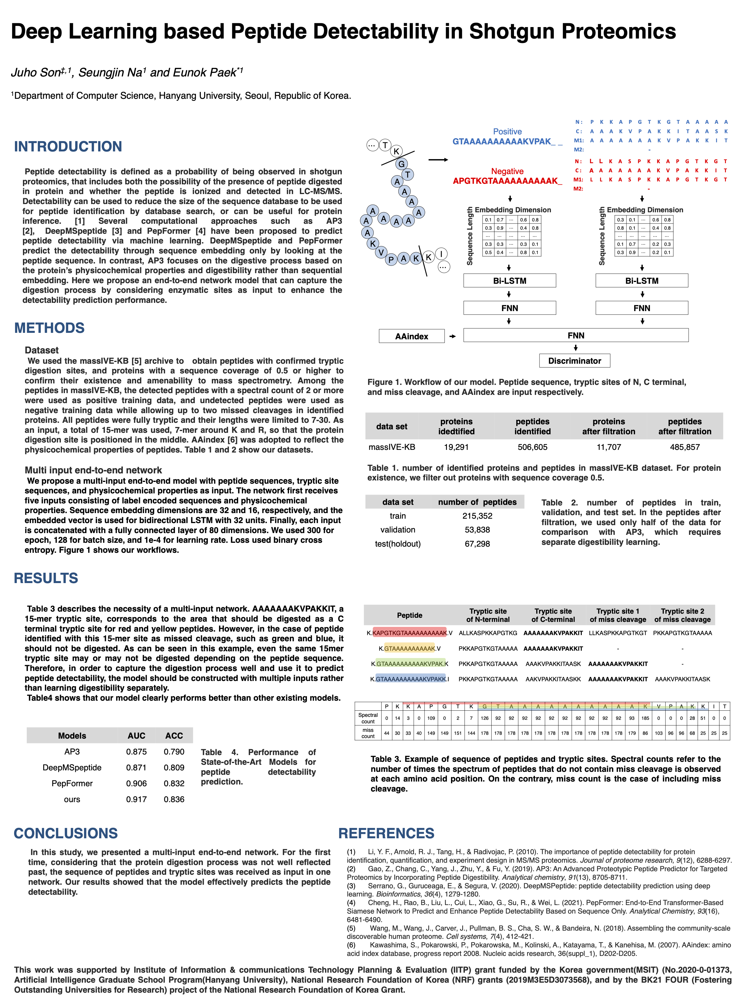
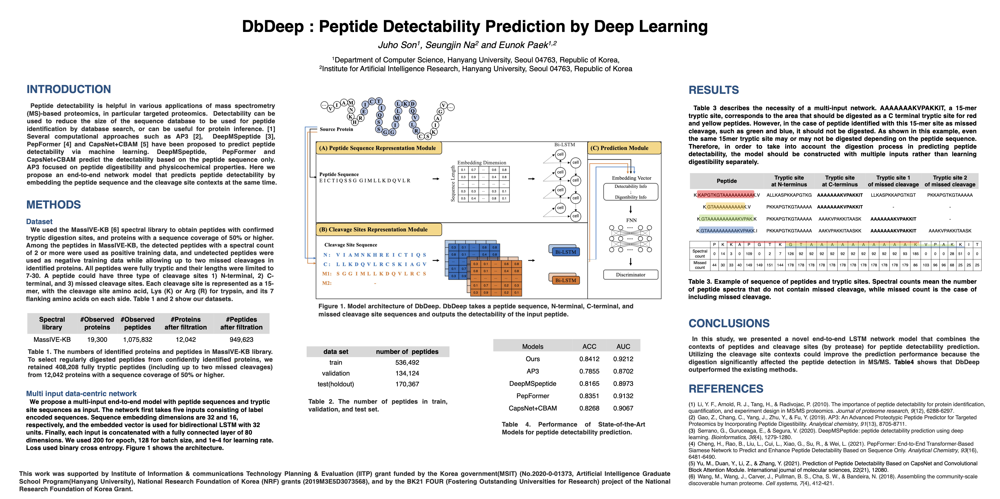

# Digestibility based Peptide Detectability Prediction by Deep Learning

# Award

# Abstract
Predicting peptide detectability can be useful in mass spectrometry based high-throughput proteomics. It can help various data analyses such as protein inference and label-free quantification perform better or database size reduction based on peptide detectability may be possible for peptide identification by database search. But it remains a challenge because peptide detection is affected by numerous parameters during protein sample preparation, digestion, separation, ionization, and precursor selection in mass spectrometry.  
Various methods based on machine learning, especially deep learning, have been proposed to predict detectability of peptides from their sequences or physicochemical properties, but they did not pay much attention to the detection process of peptides.  
Here, we present an end-to-end network model, which contains a module representing the digestion process of peptides with an LSTM architecture based on peptide and cleavage site sequences as well.  
In particular, we have found out that learning the digestibility model separately from the entire proteomic analysis model might be seriously flawed due to a multi labelling problem, and a more holistic approach was essential, thus an end-to-end network model is proposed.  

# Poster

